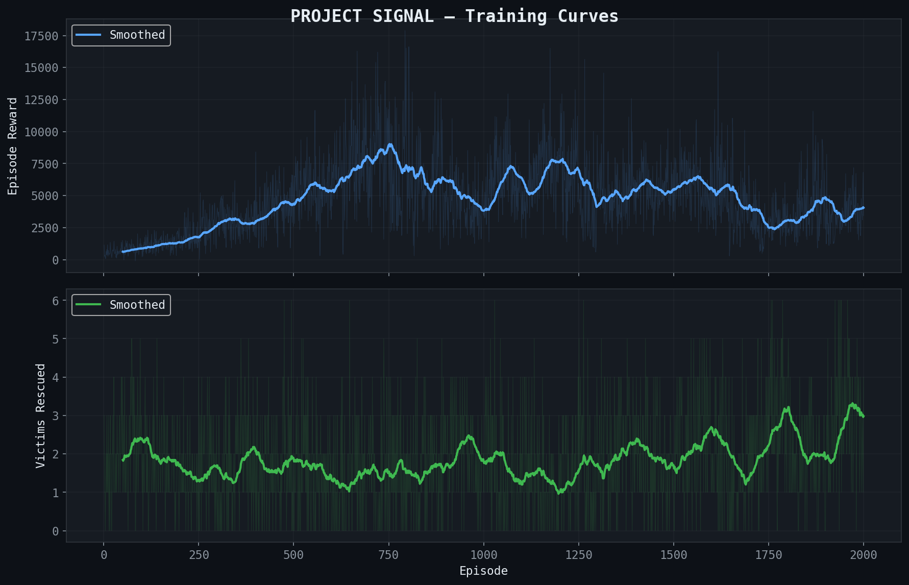
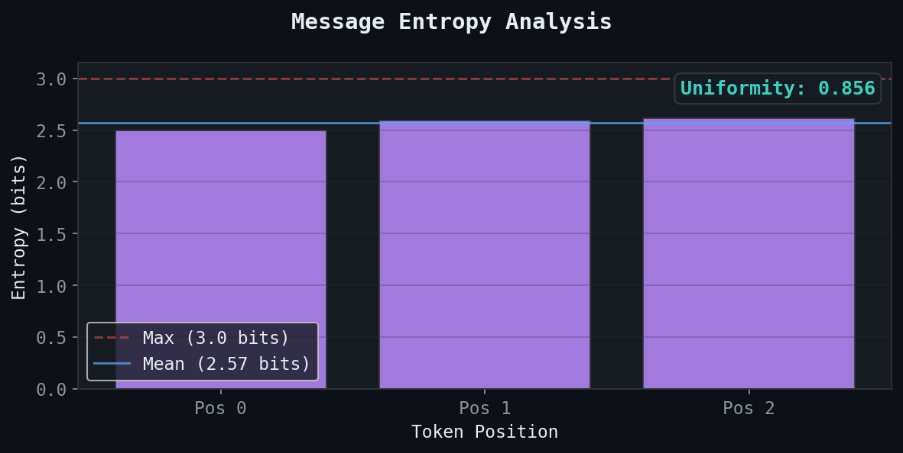
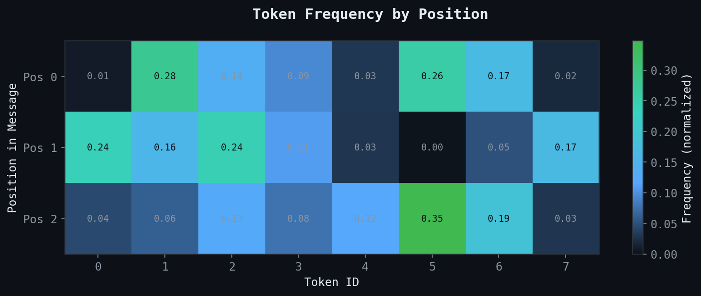
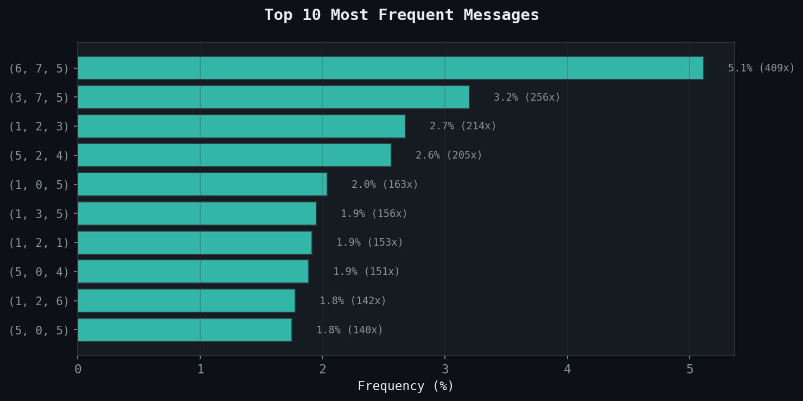
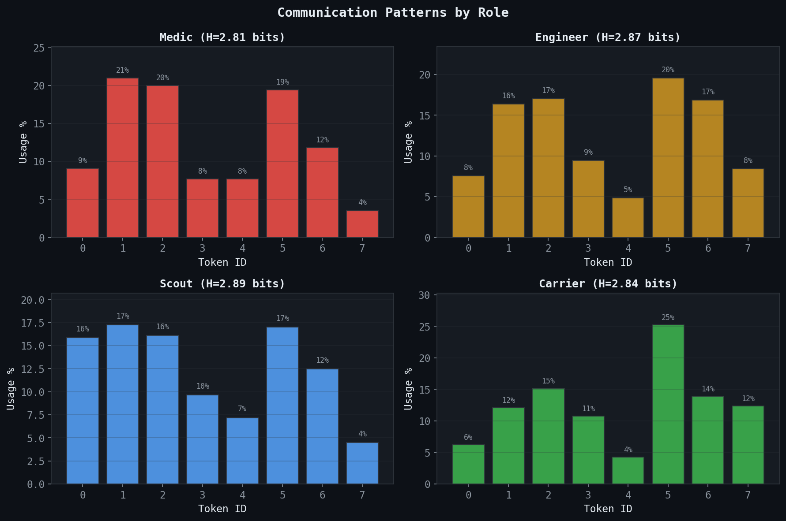
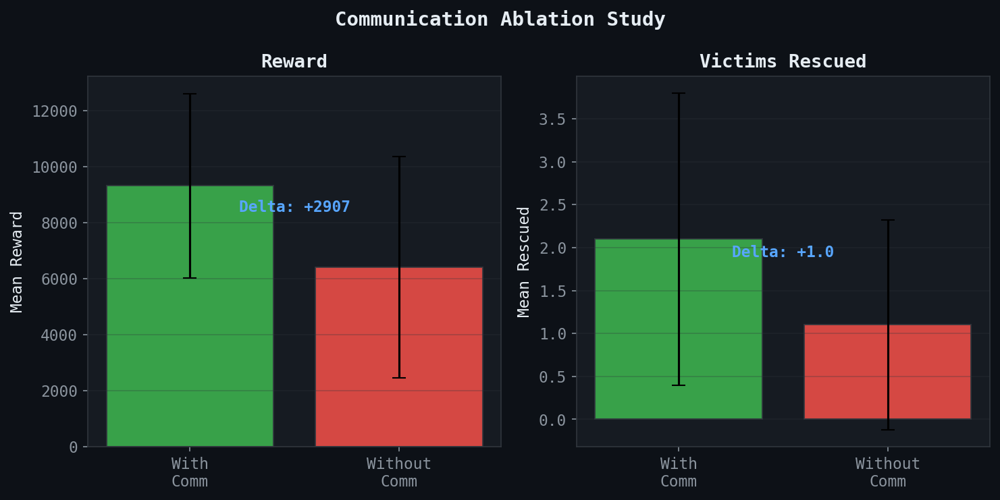

# Project SIGNAL — Results Report

## Training Summary

- **Episodes trained:** 2000
- **Best eval reward:** 0.0
- **Total parameters:** 626,022 (policy) + 158,976 (ICM)

## Emergent Language Analysis

- **Mean entropy:** 2.567 / 3.000 bits
- **Uniformity ratio:** 0.856
- **Unique messages:** 277 / 8000
- **Vocabulary utilization:** 54.1% of 512 possible

## Role Communication Patterns

Each agent role develops distinct communication behavior:

## Ablation Study: Does Communication Help?

- **Communication helps:** YES
- **Reward delta:** +2907.3
- **Rescued delta:** +1.0

## Evaluation Performance

- **Mean reward:** 10856.5 +/- 2640.4
- **Mean rescued:** 2.2
- **Mean dead:** 4.2
- **Survival rate:** 18.8%
